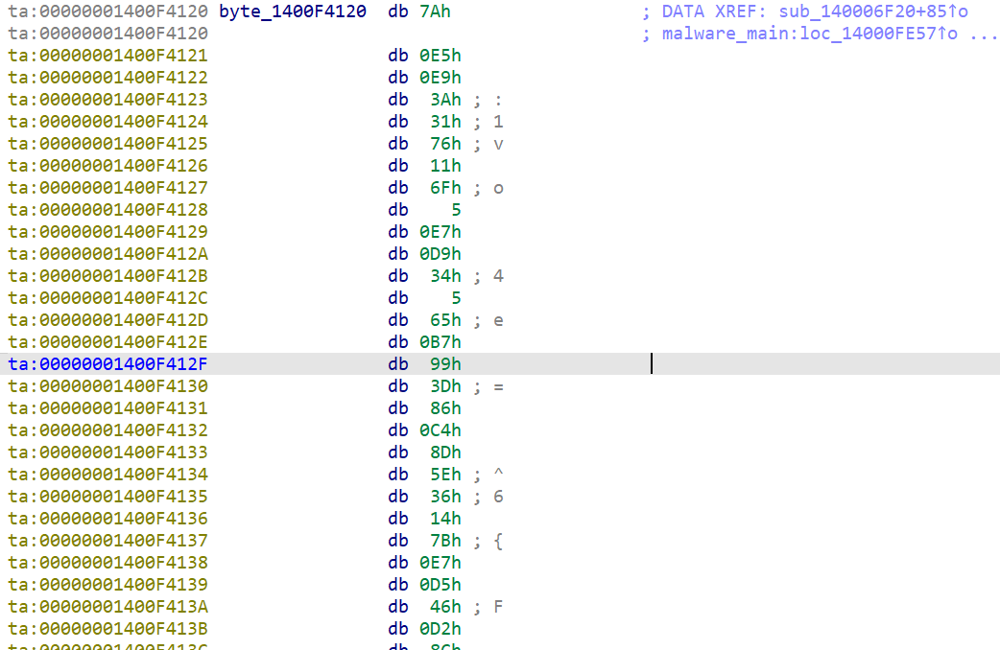
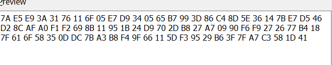
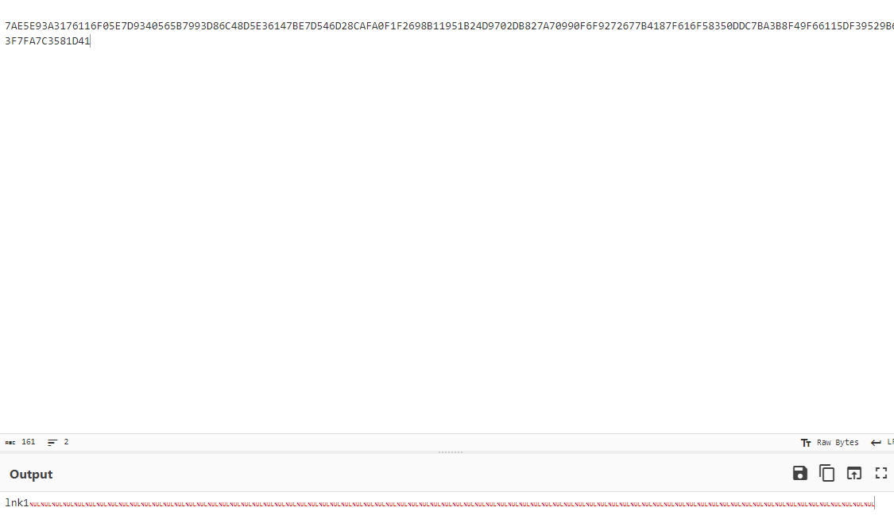

**Background** : This is an analysis of an unpacked bumblebee. This is meant to be a little reversing tutorial, as well as a demonstration of some basic reverse engineering and research skills I learned. 
The unpacked sample was downloaded from malware bazaar. I found the hash through this [article](https://bin.re/blog/the-dga-of-bumblebee/)

Bumblebee has two exports. As it is a dll, it's exports important because they contain the main functions of the malware.
We are going to look at the export starting at ```start	0000000140057D2C	[main entry]```
This is the 'main' function of the malware.  


When we scroll into the main function a little, we start noticing some intersting things. 
Let's start with this string:


I know that bumblebee uses RC4 encryption from two sources. One, from reading about the malware from articles like [this](https://www.proofpoint.com/us/blog/threat-insight/bumblebee-is-still-transforming) and two, from Flare's capa explorer plugin which indicates it found a pattern matching RC4 encryption. 


Shortly after this interesting string, a function call is made that takes another intersting string as an arugment



here we get the hex representation of the second interesting string



If we use the initial interesting string as a passphrase for a RC4 encryption algorithm to decrypt the strange jumbled up encrypted looking string, we get an interesting output



The output reads `lnk1` 
This indicates that this version of bumblebee is being distributed via lnk email attachments. Furthermore, it possibly indicates that the authors of bumblebee set their versioning to indicate the initial vector of infection. 
Shortly after